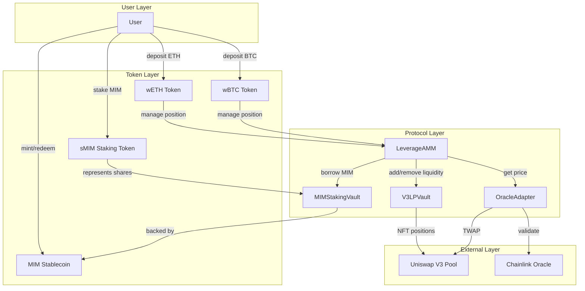
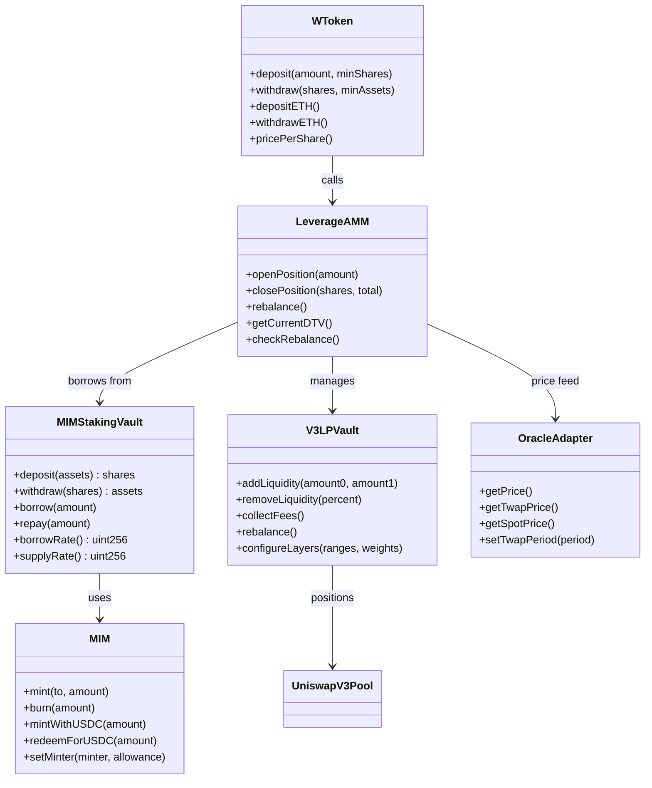
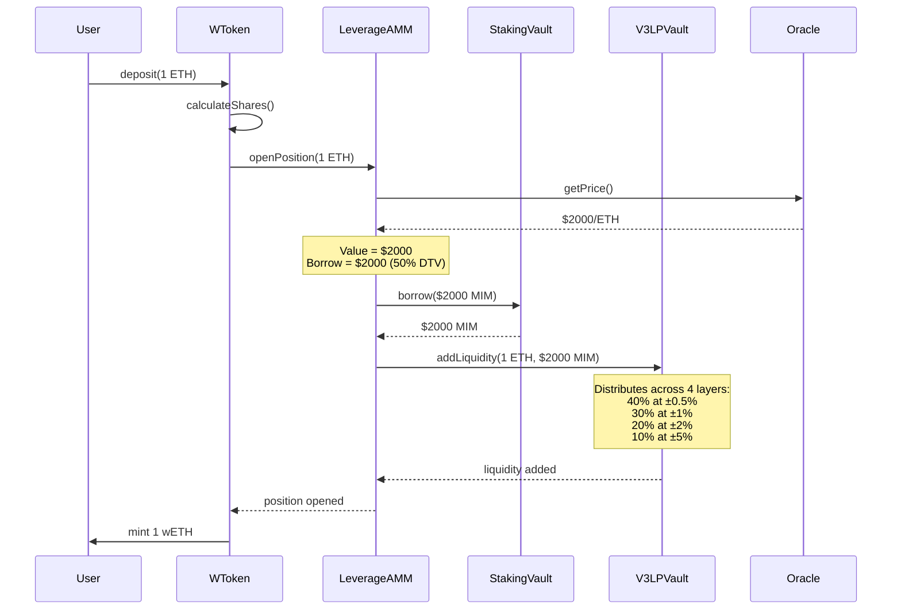
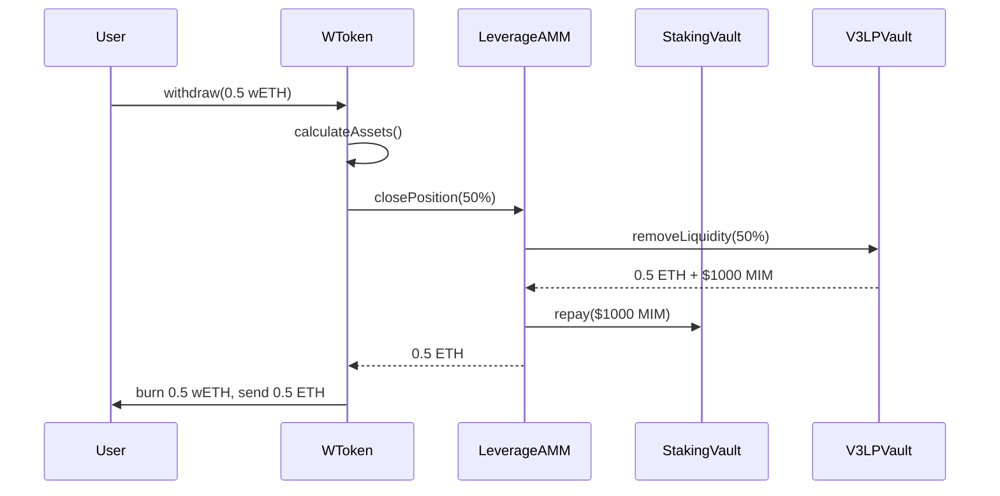
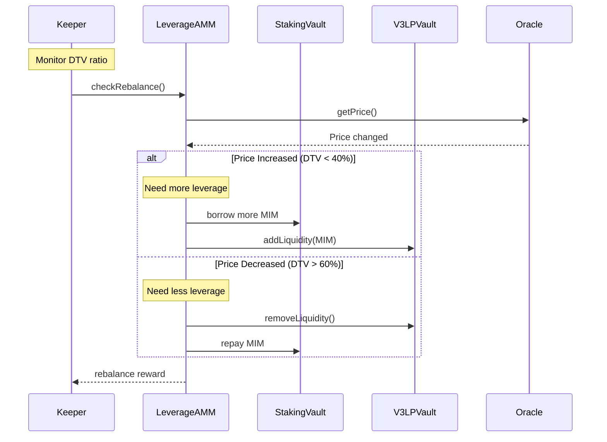
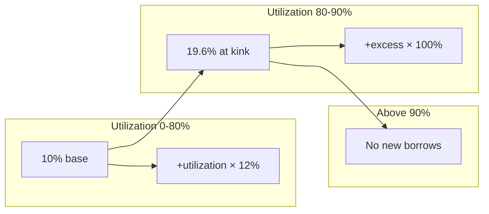
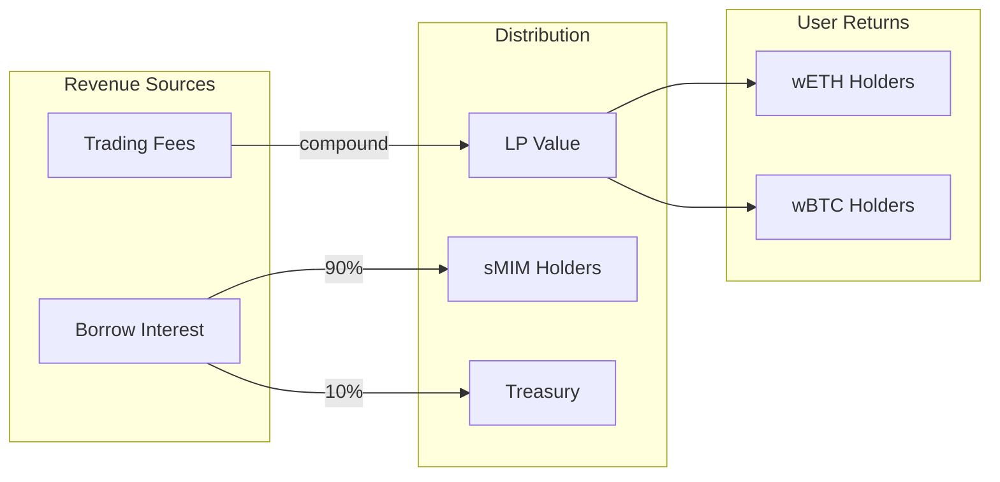
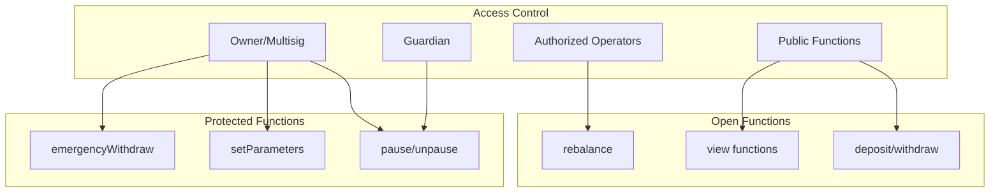

# Architecture Diagrams

## System Overview



## Contract Relationships



## Deposit Flow



## Withdrawal Flow



## Rebalancing Flow



## Interest Rate Model



## Liquidity Distribution (Curve-Style)

```
                    Liquidity Concentration
                           │
                    ██████████
                   ████████████
                  ██████████████
                 ████████████████
               ████████████████████
             ████████████████████████
           ████████████████████████████
         ████████████████████████████████
    ─────────────────────────────────────────► Price
         -5%    -2%   -1% -0.5% +0.5% +1%   +2%    +5%
         
         Layer 4 (10%)
              Layer 3 (20%)
                   Layer 2 (30%)
                        Layer 1 (40%)
```

## Value Flow



## Security Model



