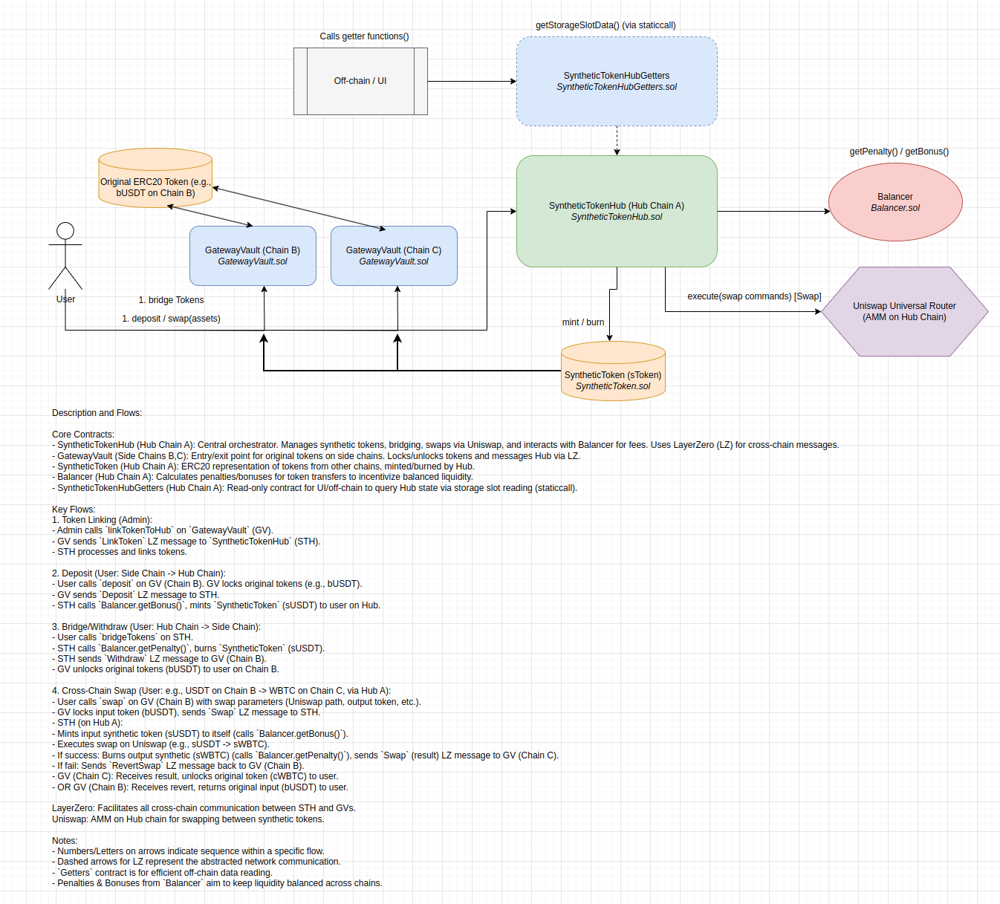

# wagmi-omnichain-app

## Installation

```bash
git clone --recursive https://github.com/RealWagmi/wagmi-omnichain-app.git
pnpm install
mv .env_example .env
npm run compile
npm run test
```

## Architecture Diagram


